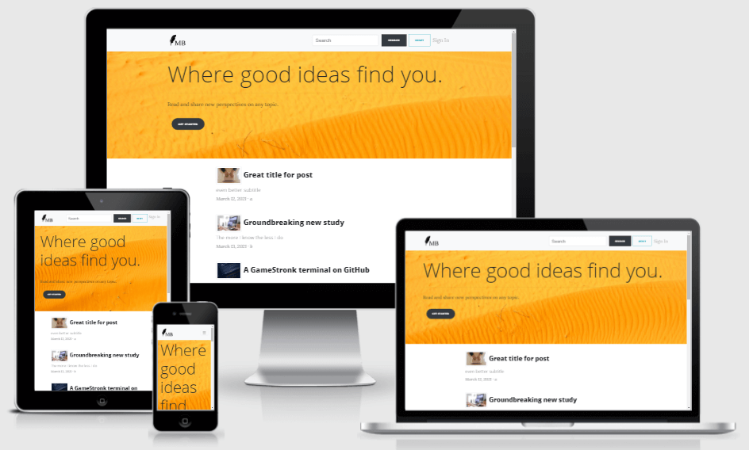
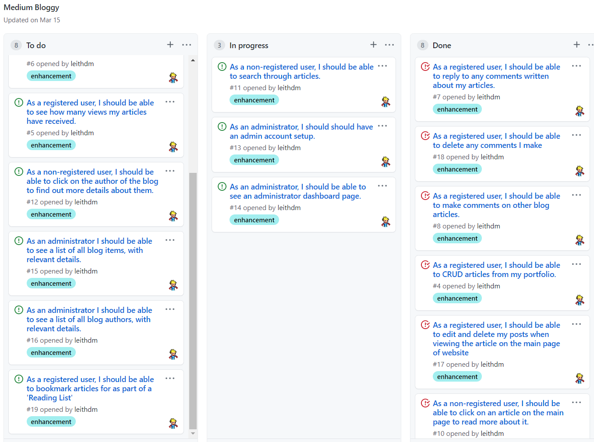

- [Overview](#overview)
- [UX](#ux)
  - [User Stories](#user-stories)
  - [Design](#design)
    - [Framework](#framework)
    - [Color Scheme](#color-scheme)
    - [Icons](#icons)
    - [Typography](#typography)
  - [Wireframes](#wireframes)
- [Features](#features)
  - [Existing Features](#existing-features)
  - [Future Features](#future-features)
- [Technologies Used](#technologies-used)
  - [Front-End Technologies](#front-end-technologies)
  - [Back-End Technologies](#back-end-technologies)
    - [Flask](#flask)
    - [Heroku](#heroku)
    - [Python](#python)
- [Agile Project Management](#agile-project-management)
- [Testing](#testing)
- [Deployment](#deployment)
- [Credits](#credits)
  - [Media](#media)
  - [Acknowledgments](#acknowledgments)

<br/>

---

## Overview

Medium Bloggy is a site for amateur bloggers and writers to show-case their work. You can view the deployed site [here](http://mediumbloggy.herokuapp.com/). 
The title of this site i.e *'Medium Bloggy'* is a homage to the [Medium.com](https://medium.com/) website, upon which this site is loosely based. 
This site is an example of [social journalism](https://en.wikipedia.org/wiki/Social_journalism), which relies heavily on community involvement and engagement in order to create the content. 

<br/>

## UX

This project is part of the [Code Institute](https://codeinstitute.net/) Full Stack Software Development course, specifically **Module 3: Data Centric Development**. 

The objective for this milestone project is to "*build a full-stack site that allows your users to manage a common dataset about a particular domain*".

<br/>

### User Stories

- User Stories were written from the perspective of x3 different user(s):
    - the non-registered user that wants to read blog articles, without contributing content. 
    - the registered user that wants to write blog articles or comment on other articles.
    - the site administrator.

<br/>

"**__As a *non-registered user*, I__** ______________________________________________"

- should be presented with blog article on the main page. 
- should be able to click on an article on the main page to read more about it. 
- should be able to search through articles. 
- should be able to click on the author of the blog to find out more details about them.

<br/>

"**__As a *registered user*, I__** ______________________________________________"

- should be able to register an account with the site in order to publish articles. 
- should be able to create a blogger portfolio page, with relevant details. 
- should be able to CRUD my portfolio page. 
- should be able to CRUD articles from my portfolio. 
- should be able to see how many views my articles have received. 
- should be able to see how many likes my articles have received.
- should be able to reply to any comments written about my articles.
- should be able to make comments on other blog articles. 

<br/>

"**__As an *administrator*, I__** ______________________________________________"

- should be able to see an administrator dashboard page. 
- should be able to see a list of all blog posts, with relevant details. 
- should be able to see a list of all blog authors, with relevant details.
- should be able to delete blog posts. 

<br/>

### Design

- The overall concept was to emulate a *printed newspaper* by having a minimalist black and white color scheme, with a modern sans serif typography. 

<br/>

#### Framework

- [StartBootstrap](https://startbootstrap.com/) provide a free Bootstrap template called ['Clean-Blog'](https://startbootstrap.com/previews/clean-blog). This template was used to provide an initial style and coloring to the site. 
- [Flask 1.1](https://flask.palletsprojects.com/en/1.1.x/) is a micro-framework that is used to render the back-end Python with front-end Bootstrap. 

<br/>

#### Color Scheme

In keeping with the *printed newspaper* theme, minimalist colors are employed. 

-  `#212529` body text and background
-  `#868e96` block quotes
-  `#0085A1` hover

<br/>

#### Icons

- [Font Awesome 5.6.1](https://fontawesome.com/) icons are used for the social media links. 

<br/>

#### Typography

- [Google Fonts](https://fonts.google.com/) were used across the site, namely:
  - [Lora](https://fonts.google.com/specimen/Lora) : for body text.   


<br/>

### Wireframes

- Wireframes were created using [Balsamiq Wireframes](https://balsamiq.com/) and can be viewed by clicking on links below.

<br/>


|    Home Page   |    Registration Page     |    Login Page    |    Individual Post    |    Profile Page    
|    :----:      |    :----:                |    :----:        |    :----:             |    :----:        |
|[Desktop/Mobile](wireframes/main.png)|[Desktop/Mobile](wireframes/registration.png)|[Desktop/Mobile](wireframes/login.png)|[Desktop/Mobile](wireframes/post.png)|[Desktop/Mobile](wireframes/profile.png)

<br/>

---

## Features

### Existing Features
  - **Register Account:** Anybody can register for free and create their own unique account. I have built-in authentication and authorization to check certain criteria is met before an account is validated. All passwords are hashed for security purposes.
  - **Log In to Account:** For existing users, I have more authentication and authorization incorporated to check that the hashed passwords and username match the database.
  - **Log Out of Account:** Users can easily log out of their account by clicking the logout button. 
  - **View All Posts:** On the *home* page, all blog posts are initially displayed, based on date of submission. 
  - **Search Posts:** The user can search for a relevant blog post, searched by Title. 
  - **CRUD Posts:** A registered user can create, read, update and delete their blog posts.
  - **Administrator Superuser:** With ability to delete and blog post from database. 

<br/>

### Future Features
A full list of future features **can be viewed in the [Product Backlog](https://github.com/leithdm/milestone-project-3/projects/1)**, but we will briefly mention some of them here:
-  **Pagination:** the ability to paginate blog-post search results.
-  **Bookmark:** the ability for a user to bookmark articles as part of a 'Reading List'.


<br/>

---

## Technologies Used

- [PyCharm](https://www.jetbrains.com/pycharm/) - used as the primary IDE.
- [GitHub](https://github.com/) - used for remote storage of code.
- [TinyPNG](https://tinypng.com/) - used to optimize (.jpg, .png) images for faster loading.
- [Balsamiq](https://balsamiq.com/) - used to create the project's wireframes.

### Front-End Technologies

- [HTML5](https://en.wikipedia.org/wiki/HTML5) - used to provide content and structure.
- [CSS3](https://en.wikipedia.org/wiki/Cascading_Style_Sheets) - used to provide styling.
- [JavaScript ES6](https://developer.mozilla.org/en-US/docs/Web/JavaScript)
- [Google Fonts](https://fonts.google.com/) - used to provide font styling.
- [Am I Responsive?](http://ami.responsivedesign.is/) - used to show site responsiveness.

### Back-End Technologies

#### Flask
- [Flask 1.1](https://flask.palletsprojects.com/en/1.1.x/) - used as a web micro-framework. 
- [Flask-WTF 0.14.3](https://flask-wtf.readthedocs.io/en/stable/) - for integrating Flask and [WTForms](https://wtforms.readthedocs.io/en/2.3.x/). 
- [Flask-Bootstrap 3.3.7.1](https://pythonhosted.org/Flask-Bootstrap/) - packages Bootstrap into an easy to use extension.
- [Flask-CKEditor 0.4.4.1](https://pypi.org/project/Flask-CKEditor/) - CKEditor integration for Flask. 

#### Heroku
- [Heroku](https://www.heroku.com/) - to host the site.
  
#### Python
- [Python 3.9](https://www.python.org/downloads/release/python-390/) - back-end programming language. 
- [MongoDB Atlas](https://www.mongodb.com/cloud/atlas2) - to store database in the cloud. 
- [PyMongo 3.11.2](https://pymongo.readthedocs.io/en/stable/) - Python API for working with MongoDB.

<br/>

---

## Agile Project Management

[GitHub Projects](https://github.com/features/project-management/) was used to iteratively sprint through the development of this app. Each *User Story* became an individual *Issue*, and was placed in a Kanban board composed of the following columns:
1. **Backlog** - all user stories, ordered by value/priority.
2. **Sprint** - a subset of user stories to be completed in a x1 week sprint.
3. **In Progress** - user stories currently being worked on from current sprint.
4. **Done** - user stories completed, and tested.

Along with tracking user stories, Github Projects was also used to track bugs. **The full list of user stories/bugs can be viewed [here](https://github.com/leithdm/medium-bloggy/projects/2).**



<br/>

---

## Testing

The testing process can be viewed [here](TESTING.md).

<br/>

---

## Deployment

**Local Deployment**

In order to run this project locally on your own system, you will need the following installed:

- [Python3](https://www.python.org/downloads/) to run the application.
- [PIP](https://pypi.org/project/pip/) to install all app requirements.
- Any IDE such as Microsoft [Visual Studio Code](https://code.visualstudio.com/).
- [GIT](https://git-scm.com/) for cloning and version control.
- [MongoDB](https://www.mongodb.com/) to develop your own database either locally or remotely on MongoDB Atlas.

Next, there's a series of steps to take in order to proceed with local deployment:

- Clone this GitHub repository by either clicking the green Clone or download button and downloading the project as a zip-file (remember to unzip it first), or by entering the following into the Git CLI terminal:

`git clone https://github.com/leithdm/medium-bloggy.git`

- Navigate to the correct file location after unpacking the files.

`cd <path to folder>`

Create a `env.py` file with the relevant credentials. See the sample env.py file below, for example:


```
import os

os.environ.setdefault("MONGO_URI", "YOUR_MONGO_URI")

os.environ.setdefault("MONGO_DBNAME", "YOUR_MONGO_DBNAME")

os.environ.setdefault("SECRET_KEY", "YOUR_SECRET_KEY")

os.environ.setdefault("IP", "YOUR_IP")

os.environ.setdefault("PORT", "YOUR_PORT")

```

- Install all requirements from the requirements.txt file using this command:

`sudo -H pip3 -r requirements.txt`

- Sign up for a free account on [MongoDB](https://www.mongodb.com/) and create a new Database called `blog`. The Collections in that database should be as follows:

**blog_comments**

```
_id: <ObjectId>
text: <string>
comment_author: <string>
parent_post: <ObjectId>

```

**blog_posts**

```
_id: <ObjectId>
title: <string>
subtitle: <string>
body: <string>
img_url: <string>
author: <string>
date: <string>
```

**users**

```
_id: <ObjectId>
email: <string>
password: <string>
name: <string>
```

- You should now be able to launch your app using:

`flask run`

- The site should be running on `localhost` on an address similar to `http://127.0.0.1:5000`.
<br/>

**Remote Deployment:**

This site is currently deployed on Heroku using the master branch on GitHub. To implement this project on Heroku, the following steps were taken:

1. Create a **requirements.txt** file so [Heroku](https://www.heroku.com/) can install the required dependencies to run the app.

`sudo pip3 freeze --local > requirements.txt`

2. Create a **Procfile** to tell Heroku what type of application is being deployed, and how to run it.

`echo web: python run.py > Procfile`

3. Sign up for a free Heroku account, create your project app, and click the **Deploy** tab, at which point you can *Connect GitHub* as the Deployment Method, and select *Enable Automatic Deployment*.

4. In the Heroku **Settings** tab, click on the *Reveal Config Vars* button to configure environmental variables as follows:

```
IP : 0.0.0.0
MONGO_DBNAME: <your_MongoDB_name>
MONGO_URI : <link_to_your_MongoDB>
PORT : 5000
SECRET_KEY : <your_secret_key>
```
5. Your app should be successfully deployed to Heroku. 

<br/>

---

## Credits

### Media

- Images:

<br/>

### Acknowledgments

- [Precious Ijege](https://www.linkedin.com/in/precious-ijege-908a00168/?originalSubdomain=ng) - for his mentorship and guidance.