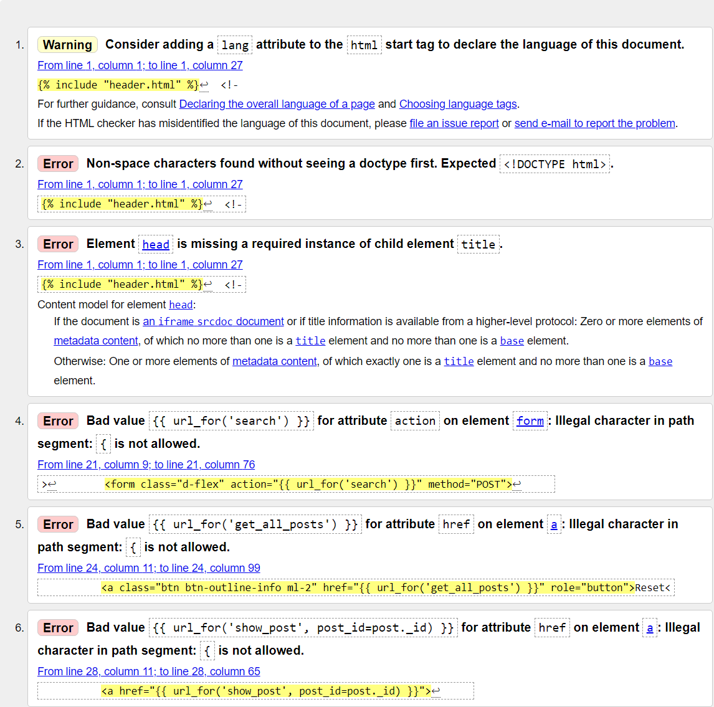

# Testing <!-- omit in toc -->

## Table of Contents
- [HTML Validator](#html-validator)
  - [W3C HTML Markup Validation Service](#w3c-html-markup-validation-service)
- [CSS Validator](#css-validator)
  - [W3C CSS Validation Service](#w3c-css-validation-service)
- [JavaScript](#javascript)
  - [JSHint](#jshint)
- [Compatability](#compatability)
  - [Manual Testing](#manual-testing)
  - [Automated Testing](#automated-testing)
    - [Chrome Dev Tools - Lighthouse](#chrome-dev-tools---lighthouse)
- [User Stories](#user-stories)
- [Bugs](#bugs)
  - [1. Bug: xxx #55](#1-bug-xxx-55)

 

# HTML Validator

## [W3C HTML Markup Validation Service](https://validator.w3.org/)

 

- [Home Page (index.html)](https://github.com/leithdm/medium-bloggy/blob/master/templates/index.html)
- [Create Post (create_post.html)](https://github.com/leithdm/medium-bloggy/blob/master/templates/create_post.html)
- [Footer (footer.html)](https://github.com/leithdm/medium-bloggy/blob/master/templates/footer.html)
- [Header (header.html)](https://github.com/leithdm/medium-bloggy/blob/master/templates/header.html)  
- [Login (login.html)](https://github.com/leithdm/medium-bloggy/blob/master/templates/login.html)
- [Post (post.html)](https://github.com/leithdm/medium-bloggy/blob/master/templates/post.html)
- [Profile (profile.html)](https://github.com/leithdm/medium-bloggy/blob/master/templates/profile.html)
- [Register (register.html)](https://github.com/leithdm/medium-bloggy/blob/master/templates/register.html)

 

**Result:** the W3C Validator for HTML does not understand the Jinja templating syntax, therefore shows repeat Errors. See sample output below for `index.html`. 
Aside from the Jinja warnings and errors, all other code is valid for each of the .html pages listed above. 

----------

 

# CSS Validator

## [W3C CSS Validation Service](https://jigsaw.w3.org/css-validator/)

 

**Result:** No Errors, 10 warnings.

 

----------

# JavaScript

## [JSHint](https://jshint.com/)

- File: [.js](assets/js/asteroid.js)

**Result:** [No Errors](assets/testing/results/jshint-asteroid-testing.PNG)

 

----------

# Compatability

## Manual Testing

- Browser compatability: To ensure a broad range of users can successfully use this site, it was manually tested across the 6 major browsers:

  - Chrome v.87
  - Edge v.85
  - Firefox v.81
  - Safari v.12
  - Opera v.71
  - Internet Explorer v.6-11 (tested via [BrowserStack](https://www.browserstack.com/test-in-internet-explorer)).

 

- Site responsiveness was tested using [Chrome DevTools](https://developers.google.com/web/tools/chrome-devtools) using profiles for a wide variety of devices.

 

- Physical Devices tested included:
  - iPhone 5 (iOS: 12.4.9)
  - iPhone 6 (iOS: 12.4.9)
  - Samsung Galaxy A10 (Model SM-A105FN, Build/QP1A, on Android 10)
  - MacBook Pro (Retina, 13", Late 2013, OS Catalina)
  - Apple iMac 27" (running Windows 10 Pro ver. 2004, OS 19041.630)

 

**Result:** Both browser compatability and site responsiveness testing can be summarised in the table below. Responsiveness was good on all of the devices listed, both physical and simulated. Brower compatability was good across all the major browsers, except for Internet Explorer 6-11.

 

----------

## Automated Testing

###

**Result:**

 

----------

### Chrome Dev Tools - Lighthouse

Further automated testing was performed using [Chrome Dev Tools - Lighthouse](https://developers.google.com/web/tools/lighthouse). Lighthouse is an open-source, automated tool for improving the quality of web pages. It performs audits under the following headers:
1. Performance
2. Accessibility
3. Best Practices
4. SEO

**Result:** see summary results below for **Desktop *index.html***

 

**Result:** see summary results below for **Mobile *index.html***

**Recommendations:** Performance improvements are recommended in the following areas:
- **Enable text compression:** in order to help the page load faster by up to 1.05s, it is recommended to compress the .js and .css files. It is also recommended to minify the .js to reduce payload sizes by up to 0.45s.
- **Remove invisible text:** there is a flash of invisible text (FOIT) while the *game.html* page waits on Font-Awesome to load. The game-pad controller briefly displays blank text for the up, left, and right button icons.
- **Use passive listeners to improve scrolling performance:** the browser does not know if the event listeners on *game.html* will prevent scrolling, so it waits for the listener to finish executing before scrolling the page. The recommendation is to add a `passive` flag to every event listener e.g.

**Conclusion:** As the project is sitting at 99% performance on Desktop, and 95% on Mobile, the suggestions are taken under advisement, but are not implemented at this point in time.

 

----------

# User Stories

**Result:** All user stories have been successfully implemented, with a :white_check_mark: to denote items that have been implemented in this game.

 

"**__As a *non-registered user*, I__** ______________________________________________"

- :white_check_mark: should be presented with blog article on the main page.
- :white_check_mark: should be able to click on an article on the main page to read more about it.
- :white_check_mark: should be able to search through articles.
- :white_check_mark: should be able to click on the author of the blog to find out more details about them.

 

"**__As a *registered user*, I__** ______________________________________________"

- :white_check_mark: should be able to register an account with the site in order to publish articles.
- :white_check_mark: should be able to create a blogger portfolio page, with relevant details.
- :white_check_mark: should be able to CRUD my portfolio page.
- :white_check_mark: should be able to CRUD articles from my portfolio.
- :white_check_mark: should be able to see how many views my articles have received.
- :white_check_mark: should be able to see how many likes my articles have received.
- :white_check_mark: should be able to reply to any comments written about my articles.
- :white_check_mark: should be able to make comments on other blog articles.

 

"**__As an *administrator*, I__** ______________________________________________"

- :white_check_mark: should be able to see an administrator dashboard page.
- :white_check_mark: should be able to see a list of all blog posts, with relevant details.
- :white_check_mark: should be able to see a list of all blog authors, with relevant details.
- :white_check_mark: should be able to delete blog posts.

 

----------

# Bugs

Using GitHub Projects, **a full list of closed bugs can be found [here](https://github.com/leithdm/medium-bloggy/issues)**. In this section we will highlight some of the more interesting ones.

## 1. [Bug: xxx #55](https://github.com/leithdm/milestone-project-2/issues/55)

[Go back to README.md file](README.md).

